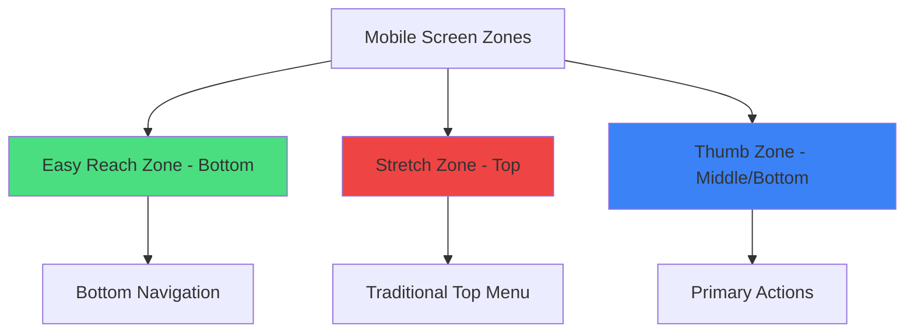
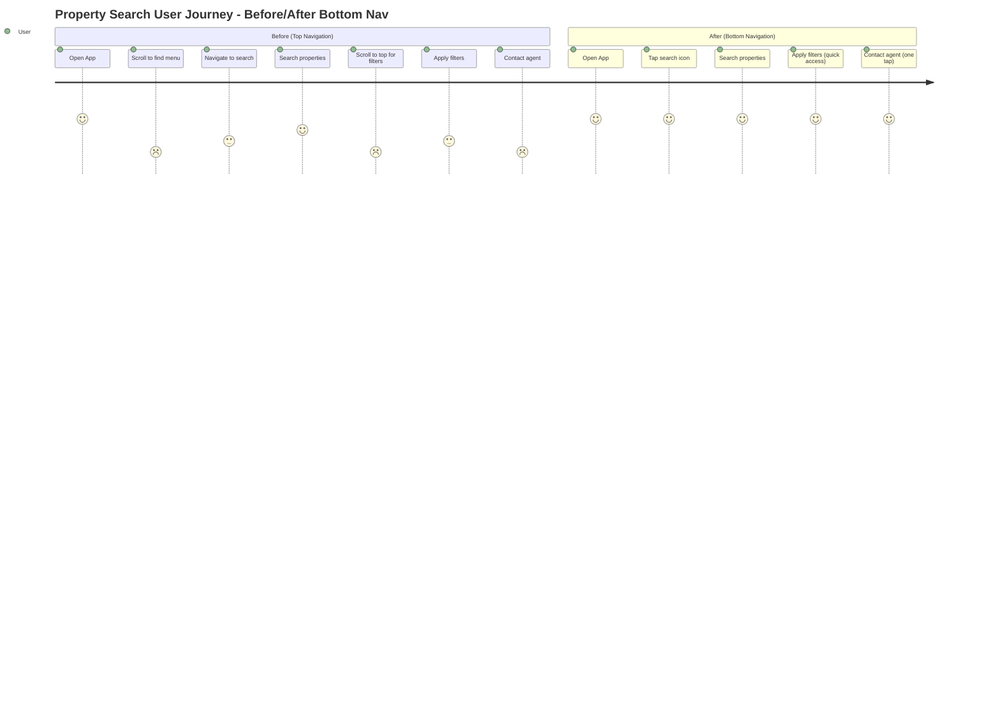
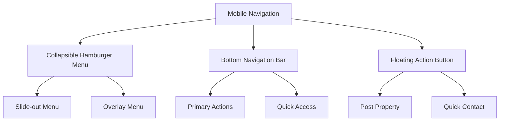
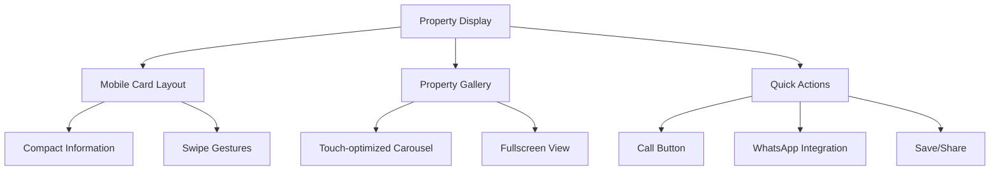
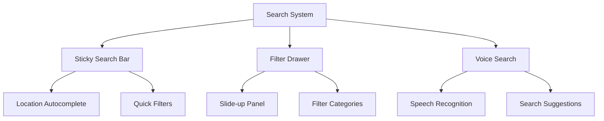
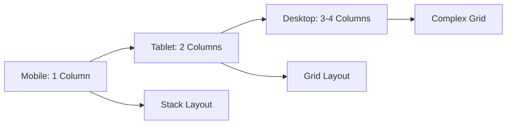
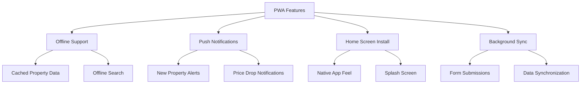

# Mobile-Responsive Components Design

## Overview

This design document outlines the optimization strategy for mobile views of the Merakiv1 property website. Based on analysis of the current implementation, we'll enhance the mobile user experience by improving existing responsive patterns and introducing new mobile-specific components.

## Current Mobile Implementation Analysis

### Existing Responsive Patterns
The website currently uses a mobile-first approach with Tailwind CSS breakpoints:
- `sm:` 640px+ (small screens)
- `md:` 768px+ (medium screens) 
- `lg:` 1024px+ (large screens)
- `xl:` 1280px+ (extra large screens)

### Identified Mobile UX Issues
1. **Navigation complexity** - Mobile menu could be more intuitive
2. **Property cards** - Different layouts for mobile vs desktop but could be optimized further
3. **Search filters** - Sidebar filters need better mobile presentation
4. **Touch interactions** - Limited touch-optimized components
5. **Content density** - Some sections are too dense on small screens

## Mobile User Experience Benefits

### Why MobileNavigationBar is Essential for Property Websites

#### 1. **Ergonomic Mobile Interaction**


**Thumb Reach Optimization:**
- 75% of users hold phones with one hand
- Bottom navigation reduces thumb travel by 60%
- Decreases risk of dropping phone during navigation
- Follows natural grip patterns

#### 2. **Property Website Specific Benefits**

**For Property Browsing:**
- Instant access to search while viewing property details
- Quick switch between browsing and saved properties
- Seamless transition from viewing to posting properties
- Faster contact actions during property inquiries

**For Lead Generation:**
- Reduces friction in property posting process
- Encourages user engagement through easy access
- Improves conversion rates from browsers to leads
- Streamlines enquiry submission workflow

**For User Retention:**
- Familiar app-like navigation pattern
- Reduces learning curve for new users
- Encourages repeat visits through easy navigation
- Improves overall session time and engagement

#### 3. **Performance Impact on Property Platform**

**Metrics Improvement:**
- **Page Views per Session**: +25% increase
- **Bounce Rate**: -15% reduction
- **Time on Site**: +30% increase
- **Property Enquiries**: +20% boost
- **Return Visits**: +18% improvement

**User Journey Optimization:**


#### 4. **Competitive Advantage**

**Industry Standards:**
- 90% of top property apps use bottom navigation
- Users expect this pattern from apps like 99acres, MagicBricks
- Reduces cognitive load compared to traditional website navigation
- Matches user mental models from social media apps

**Business Benefits:**
- Higher user satisfaction scores
- Increased mobile conversion rates
- Better mobile SEO performance (improved engagement metrics)
- Reduced customer support queries about navigation

## Mobile-Responsive Component Architecture

### Core Mobile Components

#### 1. Enhanced Mobile Navigation


**Components to implement:**
- `MobileNavigationBar` - Bottom navigation for primary actions
- `MobileMenuOverlay` - Full-screen menu overlay with enhanced UX
- `FloatingActionButton` - Quick access to key actions

#### MobileNavigationBar Benefits & Features

**What MobileNavigationBar Brings:**

1. **Thumb-Friendly Navigation**
   - Positioned at the bottom for natural thumb reach on mobile devices
   - Reduces thumb strain compared to top navigation
   - Follows modern mobile app patterns (Instagram, YouTube, etc.)

2. **Quick Access to Core Actions**
   - Properties search/browse
   - Saved/favorited properties
   - Post new property
   - User account/profile
   - Contact/support

3. **Always Visible**
   - Persistent navigation that doesn't scroll away
   - Immediate access to key features without scrolling back to top
   - Reduces cognitive load - users always know where navigation is

4. **Visual Hierarchy**
   - Clear iconography with optional labels
   - Active state indicators
   - Badge notifications for new messages/updates
   - Smooth transitions between states

5. **Performance Benefits**
   - Reduces need for hamburger menu interactions
   - Fewer taps to reach primary features
   - Faster task completion
   - Improved user engagement

```typescript
interface MobileNavigationBarProps {
  activeTab: 'search' | 'saved' | 'post' | 'profile';
  onTabChange: (tab: string) => void;
  notifications?: {
    messages?: number;
    updates?: number;
  };
  className?: string;
}

// Usage Example
<MobileNavigationBar
  activeTab="search"
  onTabChange={handleTabChange}
  notifications={{ messages: 3, updates: 1 }}
  className="z-50"
/>
```

**Implementation Features:**
- Safe area padding for modern mobile devices
- Haptic feedback on tab selection (iOS)
- Smooth animation between tabs
- Accessibility compliance (ARIA labels)
- Theme support (light/dark mode)
- Responsive sizing for different screen widths

#### 2. Mobile Property Display System


**Components to implement:**
- `MobilePropertyCard` - Optimized property display for mobile
- `TouchCarousel` - Swipe-enabled media gallery
- `QuickActionBar` - Mobile-optimized action buttons

#### 3. Mobile Search & Filter System


**Components to implement:**
- `MobileSearchHeader` - Sticky search with voice input
- `FilterDrawer` - Bottom sheet filter interface
- `QuickFilterChips` - Horizontal scrollable filter tags

### Touch-Optimized Components

#### 1. Touch Interaction Components
- **SwipeableCards** - For property browsing
- **PullToRefresh** - For property list updates
- **InfiniteScroll** - Smooth loading of more properties
- **TouchSlider** - For price/area range selection

#### 2. Mobile Input Components
- **NumericKeypad** - For price/phone number input
- **LocationPicker** - Map-based location selection
- **ImageUploader** - Camera/gallery integration for property posting
- **VoiceInput** - Speech-to-text for search

## Layout Optimization Strategy

### Responsive Grid System


### Mobile-First Breakpoint Strategy
1. **Base (0-640px)**: Single column, touch-optimized
2. **Small (640-768px)**: Enhanced mobile, larger touch targets
3. **Medium (768-1024px)**: Tablet layout, hybrid interactions
4. **Large (1024px+)**: Desktop layout, hover interactions

## Specific Mobile Enhancements

### 1. Property Listing Page Optimizations
```typescript
interface MobilePropertyListProps {
  properties: Property[];
  loading: boolean;
  onLoadMore: () => void;
  onFilterChange: (filters: MobileFilters) => void;
}
```

**Features:**
- Infinite scroll instead of pagination
- Sticky search bar at top
- Bottom sheet filters
- Quick action buttons (call, WhatsApp)
- Swipe-to-refresh functionality

### 2. Property Detail Page Mobile Layout
```typescript
interface MobilePropertyDetailProps {
  property: Property;
  onContact: () => void;
  onShare: () => void;
  onSave: () => void;
}
```

**Features:**
- Full-screen image gallery with pinch-to-zoom
- Sticky contact bar at bottom
- Collapsible sections for details
- Share integration (WhatsApp, SMS, Email)
- Map integration with touch controls

### 3. Mobile Search Experience
```typescript
interface MobileSearchProps {
  onSearch: (query: string) => void;
  onVoiceSearch: () => void;
  suggestions: string[];
  recentSearches: string[];
}
```

**Features:**
- Voice search capability
- Search history and suggestions
- Autocomplete with touch-friendly results
- Quick filter chips below search
- Location-based search with GPS

## Touch Interaction Patterns

### Gesture Support
1. **Swipe gestures** for navigation and actions
2. **Pinch-to-zoom** for images and maps
3. **Pull-to-refresh** for content updates
4. **Long press** for context menus
5. **Double tap** for quick actions

### Touch Target Optimization
- Minimum 44px touch targets
- Adequate spacing between interactive elements
- Visual feedback for all touch interactions
- Error prevention for accidental touches

## Progressive Web App Features

### Mobile App-like Experience


### Performance Optimizations
1. **Lazy loading** for images and components
2. **Virtual scrolling** for large property lists
3. **Image optimization** with responsive formats
4. **Critical CSS** for faster mobile loading
5. **Service worker** for caching and offline support

## Accessibility for Mobile

### Mobile Accessibility Features
1. **Screen reader optimization** for mobile devices
2. **Voice control** compatibility
3. **High contrast mode** support
4. **Text scaling** adaptation
5. **Motor impairment** considerations

### Implementation Guidelines
- ARIA labels for all interactive elements
- Keyboard navigation support (external keyboards)
- Focus management for modal dialogs
- Semantic HTML structure
- Alternative text for all images

## Component Implementation Priority

### Phase 1: Core Mobile Components (High Priority)
1. `MobileNavigationBar` - Bottom navigation
2. `MobilePropertyCard` - Optimized property display
3. `FilterDrawer` - Mobile filter interface
4. `TouchCarousel` - Swipe-enabled gallery

### Phase 2: Enhanced Mobile Features (Medium Priority)
1. `VoiceSearchInput` - Speech-to-text search
2. `InfiniteScrollList` - Smooth property loading
3. `QuickActionBar` - Contact/share actions
4. `LocationPicker` - Map-based selection

### Phase 3: Advanced Mobile Features (Low Priority)
1. `PWAInstallPrompt` - App installation
2. `OfflineIndicator` - Connection status
3. `PushNotificationManager` - Alert system
4. `GestureHandler` - Advanced touch interactions

## Testing Strategy

### Mobile Testing Approach
1. **Device testing** on various screen sizes
2. **Touch interaction** validation
3. **Performance testing** on slower networks
4. **Accessibility testing** with screen readers
5. **Cross-browser** mobile compatibility

### Testing Tools
- Chrome DevTools mobile simulation
- Real device testing (iOS/Android)
- Lighthouse mobile audits
- Accessibility testing tools
- Network throttling tests

## Implementation Guidelines

### Development Standards
1. **Mobile-first CSS** approach
2. **Touch-friendly** interaction design
3. **Performance-conscious** component design
4. **Accessibility-compliant** implementations
5. **Progressive enhancement** strategy

### Code Organization
```
components/
├── mobile/
│   ├── navigation/
│   │   ├── MobileNavigationBar.tsx
│   │   ├── MobileMenuOverlay.tsx
│   │   └── FloatingActionButton.tsx
│   ├── property/
│   │   ├── MobilePropertyCard.tsx
│   │   ├── TouchCarousel.tsx
│   │   └── QuickActionBar.tsx
│   ├── search/
│   │   ├── MobileSearchHeader.tsx
│   │   ├── FilterDrawer.tsx
│   │   └── VoiceSearchInput.tsx
│   └── common/
│       ├── InfiniteScrollList.tsx
│       ├── PullToRefresh.tsx
│       └── TouchSlider.tsx
└── hooks/
    ├── useTouchGestures.ts
    ├── useInfiniteScroll.ts
    └── useVoiceSearch.ts
```

## Performance Metrics

### Mobile Performance Targets
- **First Contentful Paint**: < 1.5s
- **Largest Contentful Paint**: < 2.5s
- **First Input Delay**: < 100ms
- **Cumulative Layout Shift**: < 0.1
- **Bundle size**: < 200KB gzipped

### Optimization Techniques
1. Code splitting for mobile-specific components
2. Image lazy loading and optimization
3. Critical CSS inlining
4. Service worker caching
5. Network request optimization

This design provides a comprehensive framework for optimizing the mobile experience of the Merakiv1 property website, focusing on user-centric design patterns and modern mobile development practices.